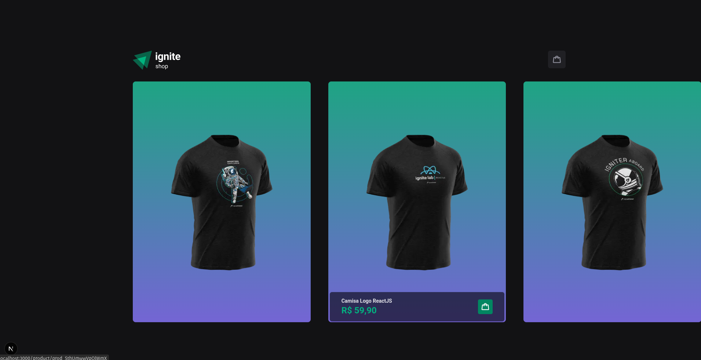
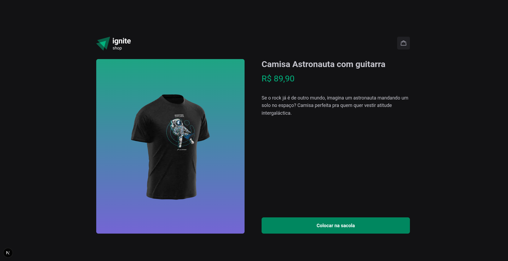
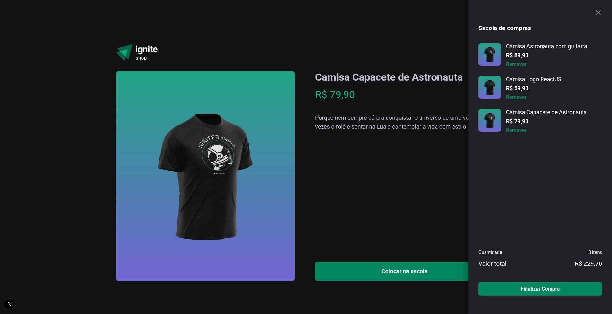
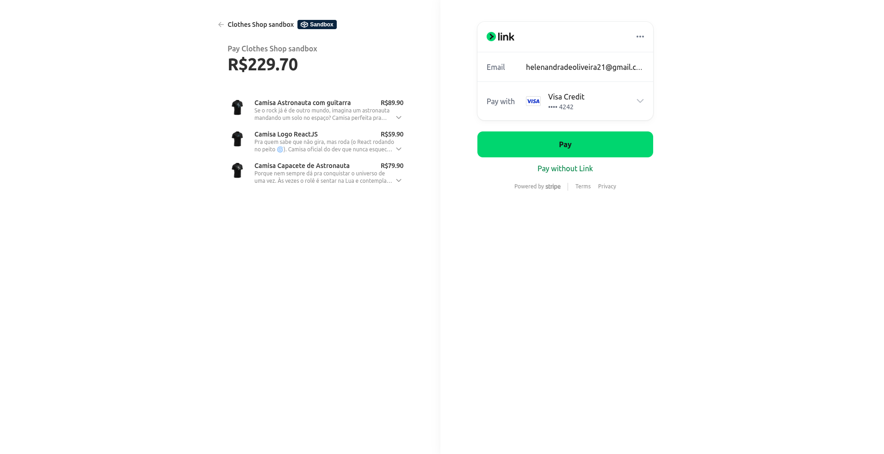
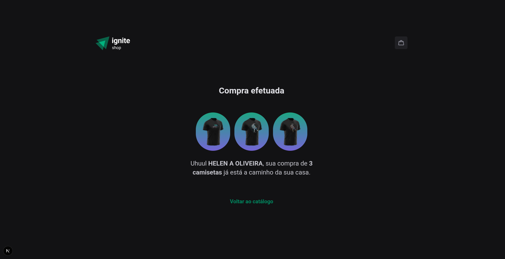

# Shop com NextJs

Este é um projeto de compras desenvolvido como desafio prático para aprender conceitos do NextJs.

    
    
    
    
    

# Funcionalidades

- Escolher um item do site e adicioná-lo ao carrinho

- Seção de imagens é feita em carrossel

- Ao abrir o carrinho os itens adicionados são mostrados, assim como o valor total da compra

- Ao realizar a compra você é direcionado a outra página de pagamento 

- Quando a compra for concluída você tem a revisão do pedido feito e pode voltar ao catálogo

# Conceitos abordados

- NextJs

- Stitches

- Stripe

- Data Fetching

# Como utilizar

1- Clone o projeto
`git@github.com:helen-andrade/shop-nextjs.git`

2- Instale as dependências
`npm i`

3- Rode o script de desenvolvimento
`npm run dev`

---

    
Feito com ♡ por Helen Andrade

